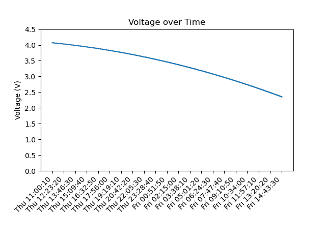

Tektronix MDO3000 MDO4000 Series Oscilloscopes
==============================================

(Tested with MDO3054)

This script is made to capture samples from the oscilloscope and record them over a long period of time (several hours or days)

Prerequisite
------------

The oscilloscope must be available on the network and remote protocol configured as terminal:

    Utility -> Config -> I/O -> Socket Server -> Protocol -> Terminal

Running the capture
-------------------

    python tektronix.py
    
Capture 1 sample on Channel 1 every 10 seconds, and store them in "out.csv".
(Oscilloscope server IP is hardcoded)

Show the plot
-------------

    python plot.py

